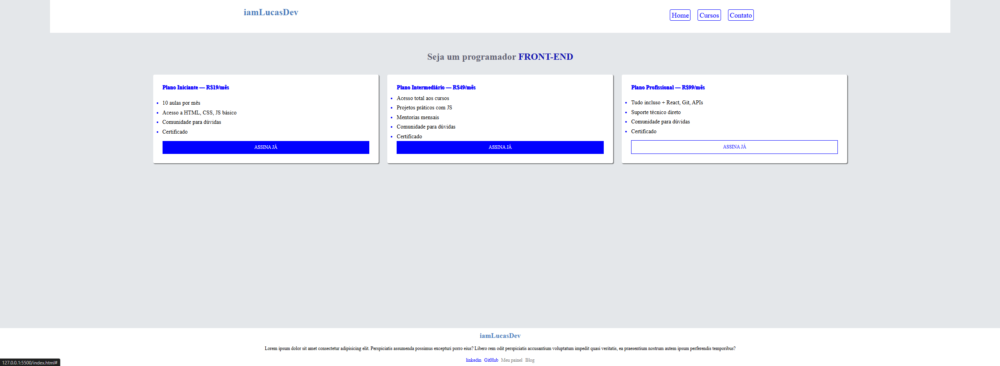

📄 Descrição para o repositório
Projeto: iamLucasDev – Landing Page para Cursos de Programação

Landing page responsiva desenvolvida com HTML5 e CSS3, simulando uma plataforma de cursos front-end. Inclui planos com diferentes níveis (Iniciante, Intermediário e Profissional), navegação principal, chamada central e rodapé com informações institucionais e links sociais.

✨ Funcionalidades:
Layout limpo e responsivo com CSS Grid

Botões interativos com efeito hover

Estrutura semântica com header, main, section, footer, nav

Rodapé com descrição institucional e navegação complementar

🔧 Tecnologias usadas:
HTML5, CSS3, Media Queries, Flexbox, Grid Layout

## 📸 Preview
 
 
## 🚀 Como executar
1. Clone o repositório
2. Abra o arquivo `index.html` no navegador

---

Desenvolvido com 💙 por iamLucasDev
